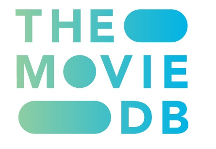

# Mezzmo Artwork Checker
A utility to help you manage your Mezzmo actor / actress artwork files.  

## Features:

- Pulls an actor listing from Mezzmo and normalizes it for comparison to poster and UserPoster
- Inserts Mezzmo actor records and normalized records into actorArtwork table
- Pulls UserPoster listing and inserts file into userPosterFile table
- Updates Mezzmo actorArtwork table if there is a UserPoster file match
- Pulls Poster listing and inserts file posterFile table
- Updates Mezzmo actorArtwork table if there is a Poster file match
- CSV export option
- Artwork size is fixed 300x450 (WxH) pixels.  User selectable sizing is being explored.
- Last checked tracking and status to keep track of your images 
- Option to retrieve missing artwork images from both TMDB and IMDB
- Command line option to mark images as bad and won't attempt downloading again.
- Additional Bad Images folder where bad images can be drug and will be marked as bad.  
 

## Installation and usage:

-  Download the Mezzmo Artwork Checker zipfile
-  Unzip file into an empty folder on your system
-  Ensure you have Python installed on Windows or Linux.  Preferably version 3.x 
-  Edit the config.text file with the location of your Mezzmo
   database and artwork.  You can add an optional IMDB API Key
   for additional image artwork checking.  Adjust query TMDB / IMDB 
   query counts.  Maximum is 1000 per run of the Mezzmo Artwork Checker.
   It is suggested to leave the query counts at 30 for the first image
   fetch to ensure everything is working and then increase it up to as 
   high as 1000.
-  Open a command window (if Windows) and run mezzmo_actor.py 
   See optional command line arguments below.    
   No arguments runs the actor artwork checker normally 
-  Recommended usage sequence is:
   - run mezzmo_actor.py
   - run mezzmo_actor.py images
   - Review images in TMDB and IMDB folders
   - Move bad images to "bad images" folder
   - Move good images to your Mezzmo \UserPoster folder
   - run mezzmo_actor.py bad 

   
## Command line arguments:  (Limit 1 at a time)

- <b>clean</b>	-  Clears all table records in the mezzmo_artwork.db database
- <b>csv</b>    -  Runs the Mezzmo Artwork checker normallly but also outputs  
         the actorArtwork table to a CSV file actorartwork.csv  .
- <b>noactor</b>-  Creates a CSV file with Mezzmo information for actors not   
         found in TMDB or IMDB
- <b>noactor all</b>-  Creates a CSV file with Mezzmo information for actors not   
         found in TMDB or IMDB and creates CSV file of all movies with matching actors.
 and a CSV file of all movies with matching actors . 
- <b>images</b> -  Attempts to fetch missing artwork images from TMDB and IMDB  (See readme.txt) 
         An optional number can be entered to override the config.txt file settings. 
         - Example:   mezzmo_actor.py images 100     (Perform 100 TMDB image queries)
- <b>bad name </b>  -  Marks actor image file from IMDB as bad so it won't be fecthed again.  
         - Example:   mezzmo_actor.py bad john-doe (file extension is optional)
- <b>bad</b>    -  Without any additonal arguments processes the "bad images" folder
            
         
 The CSV export utility currently requires Python version 3 or higher.  

           
    

